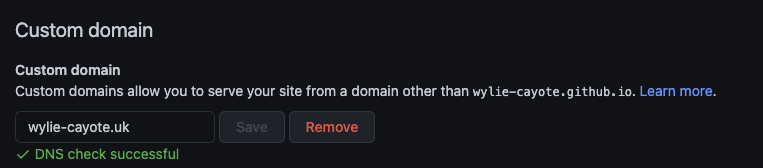

**GitHub pages + Gatsby + Cloudflare = Cheapest, effortless setup, full-featured personal blog.** 

- Costs less than **10$/year**.
- Get **100/100 [lighthouse score](https://mcdsystems.co.uk/lighthouse-scores-what-are-they-and-why-are-they-important/)** on all categories. 
- No extra coding required. 
- Edit your blog posts in markdown with ability to insert optimised images and code snippets. 
- Beautiful typography and simple layout.


> In fact this very blog, that you are reading works the same way. It costs me just about **8$/Year** and that too only for domain name registration and renewal.

### Here's a step by step guide:

##### Step-1: Create a blog powered by Gatsby and get it running on your computer

We'll be relying on [Gatsby Starter blog](https://www.gatsbyjs.com/starters/gatsbyjs/gatsby-starter-blog) from Gatsby community, for hosting your personal blog. Gatsby is an open source, React-based framework to build fast, secure and powerful websites.

> Don't worry! You don't have to learn Gatsby framework, in order to setup your blog. Rudimentary understanding of Markdown, Git and JSON will be sufficient.

1. Clone the Gatsby starter blog from it's [github repository](https://github.com/gatsbyjs/gatsby-starter-blog).

Run the following command
```bash
git clone https://github.com/gatsbyjs/gatsby-starter-blog.git
```
Prerequisite is that Git is already installed on your computer. If its not installed already, check this [link](https://github.com/git-guides/install-git) for installation guidelines. 

2. This should have created a folder called `gatsby-starter-blog`. Navigate to this folder and you should find a file structure like below.


3. Let's get the npm packages. These are other libraries and dependancies to be installed to get the blog up and running. 

Run the following command in the root folder of `gatsby-starter-blog`
```bash
npm install
```

Prerequisite is that Node.js and npm is installed on your computer. If its not installed already, check this [link](https://nodejs.org/en/download/package-manager/) for installation guidelines.

4. Now let's fire up the blog. Run the following command.
```bash
npm start
```
If everything goes well, when you open http://localhost:8000 in your browser you should see a sample blog up and running.


 Look around and check the navigation and aesthetics for yourself. As you can see the author is the creator of the starter blog **"Kyle Mathews"**. We'll replace your details and profile pic and customise it for your profile in next step.

 5. Open the file `gatsby-config.js` and in here you should see a JSON object called `module.exports` which inturn contains `siteMetadata`. 
```js
siteMetadata: {
    title: `Gatsby Starter Blog`,
    author: {
      name: `Kyle Mathews`,
      summary: `who lives and works in San Francisco building useful things.`,
    },
    description: `A starter blog demonstrating what Gatsby can do.`,
    siteUrl: `https://gatsbystarterblogsource.gatsbyjs.io/`,
    social: {
      twitter: `kylemathews`,
    },
  }
```

> You can add/update the details such as title, author of the blog, description, blog url, social media handles etc using the `siteMetadata`. 

**For example here's how `siteMetadata` looks like for this blog.**

```js
siteMetadata: {
    title: `Hi, I'm Aravind!`,
    author: {
      name: `Aravind Karnam.`,
      summary: `I write about learning, reasoning and building software products. I'm currently building the operating system for modern restaurants `,
    },
    description: `Articles on product management, user adoption, user experience, design, customer onboarding, product led growth, problem solving. Helping programmers break into product management careers`,
    siteUrl: `https://aravindkarnam.com/`,
    social: {
      twitter: `aravind_karnam`,
      github: `aravindkarnam`,
      linkedin:'aravind-karnam-rajendraprasad/'
    },
  }
```

6. Replace the Profile picture by replacing the image located at `/src/images/profile-pic.png`. 
  
If you have to change the name of the file or format to say jpg, simply look up the string "profile-pic.png" in `/src/components/bio.js` file and replace it with your new profile pic file name.

Similarly you can replace the site favicon by replacing the image located at `/src/images/gatsby-icon.png`. If the filename of image changes, you can lookup string "gatsby-icon.png" in `/gatsby-config.js` file and replace it with new filename.

7. Now we have cloned the gatsby-starter-blog, added your details as the author of the blog. Next let's explore how you can start writing blog posts

There's a folder called `/content/blog`. Here you will find a few folders each corresponding to the sample posts that are there on [blog](http://localhost:8000) currently running on your computer. 
  
For example consider the `hello-world` folder, this corresponds to [Hello world](http://localhost:8001/hello-world/) post.

> So, for every blog post you have to create a new folder (name of folder is your choice), and put a `index.md` file in it.
  
For example Inside the `hello-world` folder, there's a file called `index.md`. It looks as follows.

```markdown
---
title: Hello World
date: "2015-05-01T22:12:03.284Z"
description: "Hello World"
---

This is my first post on my new fake blog! How exciting!

I'm sure I'll write a lot more interesting things in the future.
...
```

Title and description of corresponding post can be set here, and date is corresponding to the date when you publish the article. **Everything following the --- line under description, is the contents of the blog post.** You can write contents of your blog post in markdown and it's rendered as expected. 

If your'e not familiar with markdown, it's a lightweight text formatting lanuguage using which you can control aspects like headings, bold, italic, code snippets etc. It's so easy, you can pick it up in minutes. Here's a [syntax cheatsheet](https://www.markdownguide.org/cheat-sheet/) that'll get you started.

> As for images in your blog post, just copy the image to the folder of blog post. 

To embedd it in blog post and refer it in markdown as follows.
```


for eg:

```

###### So far we have covered.

1. Cloning gatsby-starter-blog to your computer
2. Get it up and running on your computer
3. Set the site Metadata and update your details as author
4. Create new blog posts and update old ones.

> It should be clear by now, that you don't need to understand Gatsby,react or even javascript to get this up and running. All you need to know is Markdown!

Great! Your blog is ready, but we've only got this running on your local computer. Now let's try to host your site on Github Pages, so the whole world can view your blog!!


##### Step-2: Publish your blog on GitHub pages

1. Create a new repository on [GitHub](https://github.com), where you'll host your blog. You'll find a section called "Start a new repository", right on the home page. Choose **public** repository, if you don't have GitHub **Pro** subscription. 

> GitHub doesn't allow you to enable pages on Private repositories with free account.

If your username is "wylie-cayote", then pick the name of repository as "wylie-cayote.github.io". Final blog will be hosted at https://wylie-cayote.github.io.


2. Copy the link for the repo to you clipboard.


Run the following commands to push the code on your computer to github. This will add the raw code to `main` branch in your chosen repository. In future you can use this branch to access past versions of your blog and restore an old version if needed.

```bash
git remote remove origin

git remote add origin <Link copied to clipboard>

git branch -M main

git push -u origin main
```
---
ℹ️ 
<sup> **Info for readors without cursory knowledge of Git or GitHub 👉**</sup>

<sup>If you are not already logged into GitHub through your command line, you may be prompted to login at this step.
When logging in to GitHub through terminal, enter your regular GitHub username during the prompt. However for password, your regular password that you use for logging into website won't work. You'll have to create a [Personal access token](https://github.com/settings/tokens) and use that token as password.
If your'e trying to use code editors like VScode, then login will be handled through redirection to browser. </sup>

---

3. On GitHub, head over to `settings` section, then open the `pages` sub section.


4. You'll notice a message that "**Your site is live at** `https://wylie-cayote.github.io`".

However if you click on that link, you'll find the `README.md` file of the repository and not the blog you built on your computer in step 1. GitHub pages simply show's the `README.md` file in the `main` branch, which is the raw code we just pushed previously.

> Basically we'll have to build the Gatsby site(with a script ofcourse, to create js bundles, assets etc) and place those build files into a different branch (other than `main`). Then point the GitHub pages to serve those files in the new branch. 

**This may all sound complicated, but don't quit yet! I'll show you how can accomplish this in very simple steps.**

5. The best way to build and push a Gatsby app to GitHub Pages is by using a package called [gh-pages](https://www.npmjs.com/package/gh-pages). Install this package by running the following command

```bash
npm install gh-pages --save-dev
```

6. In `./package.json`, you'll find an object called `scripts`. 

Add a new script called `deploy` to this object. This script basically creates a version of your site with production-ready optimizations like packaging up your site’s config, data, and code, and creating all the static HTML pages. 

All these assests are created in `public` folder. This folder is then pushed to a different branch(other than main) called `gh-pages` on the same repository. When end users view your blog, it's the files in this folder that is loaded on their browser.

```json
{
  "scripts": {
    "deploy": "gatsby build --prefix-paths && gh-pages -d public"
  }
}
```

Now you are all set to run the deploy script. Go ahead and run the following command.

```bash
npm run deploy
```

With this we have published the build files on `gh-pages` branch

7. As a final step, head over to `Settings > Pages` <sub>(Refer to point 3.)</sub> and change the source branch for GitHub pages from `main` to `gh-pages`. Folder can stay the same ie. `/root`. Click the save button.


That's it! The blog is now ready at `https://wylie-cayote.github.io`(in your case that would be `https://{your account name}.github.io`) 

> After you change the branch from `main` to `gh-pages` give it a couple of minutes for the Pages to reflect your Gatsby Blog instead of `README.md`. If you still dont see the changes after 5 minutes do the following:
> - Try to hard refresh the page on browser -> cmd + shift + R
> - Try to redeploy the branch with `npm run deploy` command


### 🎉 Congratulations on setting up your blog! Now get out there and share your ideas with the world!

Now only catch with this blog is that it's hosted on "github.io" domain, which is fine for most beginner blogs and drumming up a small audience base for your self. 

However if you decide to go **Pro**, you may want to host your blog on your own domain name that you purchased from a registrars like [GoDaddy](https://godaddy.com),[Namecheap](https://www.namecheap.com/) etc. 

I've purchased my domain aravindkarnam.com from GoDaddy, and transferred it between different providers before finally settling with Cloudflare. I found cloudflare to be the most cost-effective and performant website hosting service.

##### Step-3: Configure a custom domain for GitHub pages

Create an account for yourself on Cloudflare and follow the steps below to register a domain, and set it up for your blog hosted on GitHub pages.

1. Head over to `Domain Registration > Register Domains`. Look up for a domain name you like, ad you'll get a listing of all available domains with different TLDs and prices. Pick one for purchasing. Keep in mind, that this is the only cost you'll have to bear for a full-featured blog for an entire year. 

_To write this blog post, I went ahead and bought the cheapest one at $4.76 `https://wylie-cayote.uk`._


2. You'll have to enter your contact details. It's mandatory and legally required for all registrars to collect this information. Don't worry though! Cloudflare redacts your contact information on [WHOIS](https://en.wikipedia.org/wiki/WHOIS) record of this domain name.

Complete payment through credit card or paypal.


> ###### If everything went well, you should see a success message like below


3. You'll find all websites that you have purchased under `websites`. Click on the corresponding site, to update it DNS records to point to Gatsby blog on Github pages.


4. Click on the name of the site, you wish to configure the GitHub pages for (in this case it's wylie-cayote.uk). Open the "DNS" section from left panel.


5. Update the DNS records, so Cloudflare knows to point to Github pages. You can create a new DNS record by clicking on the "Add Record" button.


First let's add a CNAME record. A CNAME record - Forwards one domain or subdomain to another domain. Let's add www. subdomain and point it to `wylie-cayote.github.io`(In your case it would be {username}.github.io).
 

6. Alternatively you can also add A records (which points to IP address instead of another domain). As per [GitHub's documentation](https://docs.github.com/en/pages/configuring-a-custom-domain-for-your-github-pages-site/managing-a-custom-domain-for-your-github-pages-site) for setting up custom domains, to create A records, you have point your apex domain to the IP addresses for GitHub Pages.
```
185.199.108.153
185.199.109.153
185.199.110.153
185.199.111.153
```

Add all four IP addresses, in your A records.

This is how the DNS records of the site I configured looks like...


7. Finally head over to the `settings > pages` section of your GitHub repository. Here update the Custom domain section and click on Save.

Once you click on save a DNS check will be initiated by GitHub.

If your DNS records configuration on Cloudflare was configured correctly, you should see a message as follows


That's it! You site should now be live at the domain you configured.

> If you don't immediately see the blog live on your domain, dont panic. You may have done everything correctly, but DNS changes can take up to 24 hours to propagate. [DNS propogation](https://ns1.com/resources/dns-propagation#:~:text=DNS%20propagation%20is%20the%20time,typically%20takes%20a%20few%20hours) will reach different ISPs(Internet service provider) at different rates. 
>
> For example immediately after I configured the `wylie-cayote.uk` site, my phone working on mobile data was able to show the blog. However my laptop connected through wifi(different ISP) was still throwing a `DNS_PROBE_FINISHED_NXDOMAIN` which means browser was not able to find the site I was looking for.
>
> So chill, take a nap and by the time you come back the DNS records would have updated across the internet and will have reached your ISP as well.

8. Also, GitHub pages has this problem where every consequent publish using the `npm run deploy` will overwrite the custom domain you configured in the `settings > pages` section of your repository, to an empty string.
To overcome this issue, simply update the `deploy` command as follows.
```json
{
  "scripts": {
    "deploy": "gatsby build --prefix-paths && gh-pages -d public && && echo \"wylie-cayote.uk\" > public/CNAME"
  }
}
```
of course replace the "wylie-cayote.uk" with your domain. This will fix the problem

###### 🤞🏽 I sincerly hope this article was helpful for you in setting up a blog for yourself.

>At this stage Cloudflare will prompt you to add caching and file compression. Select all the optimisations proposed by cloudflare.
>
>It's free of cost and will improve your site performance significantly.

### For writing new blog posts simply 
1. Fire up the blog on your computer with `npm start` command. 
2. For each new blog create a new folder(folder name can be slug based on post Title) and put an `index.md` file in it. Add title, description and date as described in the step 1.
3. Write your contents and preview in your browser. You can also drop the images in this folder and refer them using the syntax as follows ``
4. Once you are satisfied with your post, publish the post by running `npm run deploy` command.
5. That's it your blog should be published. In case you don't see the changes reflect immediately it could be because of caching on cloudflare. You can [purge cache](https://developers.cloudflare.com/cache/how-to/purge-cache/#purge-everything) to view the changes immediatly.
