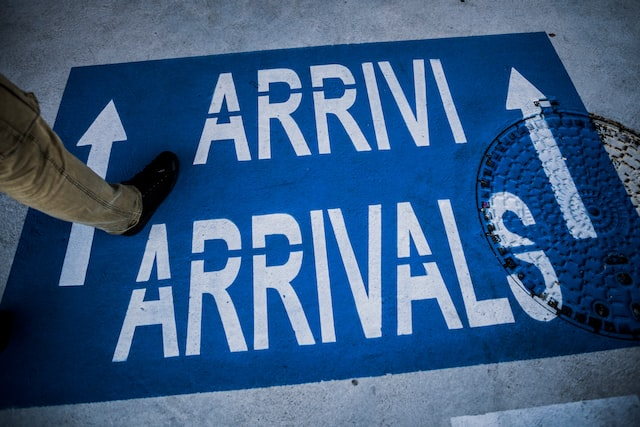

I've pondered on this very same question for months on end and finally decided to move back home in June 2019. It's been a year since I moved back. I'm writing this post, so it'll offer you a "point of view" while making your own decision.

I graduated with a master’s degree from a state university in 2017 and was working with STEM OPT on F1(student) visa. By early 2019, my H1B visa application got picked in the lottery and was being processed  at snail's pace by USCIS. I had to endure severe travel restrictions and I only had one more year left on my STEM OPT . I was finding it exhausting to live my life under the thumb of a bureaucratic organisation (USCIS) that didn't seem to care about value of a person's life that's attached to a visa application. 

Naturally an Idea took shape in my mind, "Would it be so bad to move back home ?". It took me several sleepless nights, research and planning before I made a decision to move back home in June 2019. I took me 3 hard years in US to get to a job paying 6 figure salary, but I decided to leave it all behind to start my professional journey in India.

Of course you'll also have to factor in the havoc wreaked by COVID-19 and resulting economic, geo-political and cultural implications.If you are reading this, you probably have a H1B visa already or filed multiple times during your OPT and STEM OPT period without any luck, or looking for Day 1 CPT program to merely be in valid status. 

First of all the decision to move back will be heavily dependant on your current state of financial affairs in the US. Even though there are countless number of positions in which students from India could be in, while living in US they can be broadly classified into 3 categories.

#### Extreme financial stability
You've recovered the cost of your US education (BS/MS degree). You made good money on top of that. You have a cushy job in some massive corporation(Microsoft, Google etc) that pays you handsomely, treats you well, takes good care of filing your H1B petition.

#### Moderate financial stability
You've recovered the cost of US education and made decent money on top of that, but there's uncertainty in job situation. You work as a contractor/consultant, in a long term project with good hourly pay. The company that's placing you in third party site/client, is decent (takes a reasonable cut from what the client is paying hourly) and takes immense care in processing your H1B application.  You have good relationship with the client and they are immensely dependant on you for project.

#### Poor financial stability
You were not able to recover cost of your US education and couldn't land a job post graduation. You joined some shady consultancy (these are mostly run by Andhra guys settled in US in the 90's) and they placed you in a third party site by faking everything on your resume from your skills to experience. Probably they even had someone else take the interview call for you. Once placed they dock a huge percentage of your pay and leave you peanuts as salary. H1b application is a nightmare and you have to pay for filing out of  your own pocket. You are afraid that any day your client/site will catch your lies about experience and fire you. I know many poor souls who got stuck in this category and it is absolute hell.

> My analysis could be applied to any of the categories above as the long term risk of staying in US on a H1B is same for all categories in my opinion. Only purpose of the above classification is in assessing the opportunity cost, in leaving your US life behind. 
>
> **Even though you may be financially stable today, an unexpected recession and cost cutting strategy of your company may leave you job less and you could be joining a douchebag consultancy just to stay in status. Only things stopping your downfall is your level of desperation and the amount of moral degeneracy you can tolerate.**

Before I go further, few may look at successful immigrant stories like Satya Nadella. Sunder Picchai and vinod khosla to argue that I'm wrong in my opinions. Indian diaspora that makes you believe that this wild goose chase behind a green card is possible, immigrated to US in a different era with a different political landscape. 

There were no lengthy waitlists for green card. Easier access to green card or citizenship meant they could have a slice of the American dream and eat it. Therefore could forgo their past life in India and still live a happier life. 

My arguments below **only** apply to people who immigrated to US after 2010, for higher education and career prospects. On a H1B work visa you’e subjected to the following conditions-

#### Unending uncertainty
As long as your visa is tied to your job and you can be fired from your job with two weeks notice (which is almost any job in private sector), leaves a high amount of uncertainty looming over your head. If you get fired, H1B requires you have to move out of US within one or two months, or risk loosing your status. Worst case scenario, You'll pay some kind fraud consultancy to run a payroll for you, just to maintain status. 

This uncertainty may be an acceptable pain when you are a bachelor with limited responsibilities, but try doing that being a family man. Your life could become hell. Any news of economic instability will cause fear and frustration. The only thing that can give you any solace is if you had some kind of a leverage on your employer (project cannot run without you), but that's very hard to achieve and can happen only if your manager/boss is a village idiot.

#### Vulnerability to exploitation 
Your employer knows that you need this job badly and that your right to live in the country(visa) depends on it. They know that you will be reluctant to move to an unfamiliar employer, even if they offered better remuneration or work environment. The paperwork to change jobs (H1B visa transfer) itself is a bureaucratic mess with accompanying travel restrictions. 

Instead of trying to motivate you with bonuses, pay rise and promotions there is a good chance your manager will just remind you how lucky you are to just have this job. It will become harder to stomach this when your other colleagues(citizens) get a different treatment compared to you. This vulnerability becomes even more evident when you are placed in a third party site by a consultancy. While there are some good consultancies out there, most of them fleece the employees by taking 20% to 50% of their pay checks without health-insurance, severance packages etc. Imagine living life under someones boot, for years on end like that.

#### Not being there with your family and friends in India
While you are busy running the rat race in US, your people in India are living their lives without you in it. You are missing your cousin's marriages, grandparent's funerals and parents retirements etc. At some point people over there are going to stop missing you. 

In the end, it may be worth it if the life you are living in US is tangible, but it's not. Your life in US can be uprooted with months or weeks to spare or in a second's stroke of president's pen. US will discard you to your third world country the minute they figure out you are not useful to them. You have no rights there and you cannot protest. When you are finally booted out from US, you may not have the same life in India that you had when you left for US. People have moved on without you. Is it worth missing your loved ones, for a life that's so fragile. Even in India you are still going to run a rat race, but it will be far more meaningful.

#### Lack of freedom in choice of livelihood
Any type of work visa comes with a plethora of conditions on salary, job site, nature of work (STEM fields etc) which means there will be plenty of opportunities that you will be interested in but couldn't take up. 

For example, you might want to work in a high growth startup but the salary may not be market rate for that role. However you want to take it up because you see the upside in working for the startup, but try explaining it to USCIS. How about one day you are done working your 9 to 5 job and want to open a restaurant or own a farm. Maybe you just had a personal tragedy and want to take a break from job for a year!! You can't do any of this on H1B unless you also work a 9 to 5 STEM job and your'e definitely not going to get green card until you are too old and out of energy.

> If you already don't know, most people don't usually retire in private sector jobs. One day they get fired and won't be able to find a job anymore. Imagine your life, if you are on a temp work visa on that day. You are married with kids, a house on mortgage and car on lease. Your kids are so out of touch with life in your home country and you can't even fathom coming back to it. You cannot legally stay in your adopted country. Imagine that misery.

> Personally I care more about protecting myself from misery than optimising for fleeting happiness. So that's where I'm coming from.

By all means I'm not against spending a few(5 to 6) years in the US and earn a few lakh rupees before coming back. However if you intend to stay on a temp work visa for decades (till you turn 50), raise your kids in US, buy a house and build your life, you are in for a roller coaster ride and probably you will end up in an accident before the ride ends. 

The allure of living in a society where roads are wide, rules are followed, shit flows underground, contracts are enforced, is understandable. For a generation that grew up on watching American TV shows and aspired for the American dream, it's really hard to throw it all away and move back home and deal with all the pains of a growing economy. Having said that home is where you'll be truly free. Since 2008-2010 period, H1B has become a golden cage for those who intend to achieve the American dream with it. 

No amount of creature comforts can make you forget the fact that the life, you are so carefully crafting can be uprooted at a moment's notice. **It is at the mercy of a system that only means to juice you and discard you like pulp.**

I feel much better since moving home, building a future for people who invested in my life since I was a kid. Sure, I miss the road trips to sprawling US national parks during the long weekends, however that hole is filled by frequent visits to my parent's, and friends that I grew up with. At this point, Corona pandemic has caused Americans to take further steps that will strangle people living in US on H1B program. 

💡 My advice...

> Don't wait till they grab you by the collar and throw you out. Take the cue and come back.
> 
> The post colonial world order that was set at the end of World war II is coming to an end. There's no knowing who will come on top this time. May be its China or may be its not, but it's definitely not America. Today's American culture is not the same culture that sent humans to the moon. There's no oppurnity cost from not living in US anymore!
>
> Even though the tech scene in India cannot compare to that of bay area, it's not nothing. There's great salaries and growth opportunities in the new age startups. India is minting new unicorns and decacorns every other week. Come home and build your future in a place where your ancestors have lived for centuries and you cannot be kicked out.
